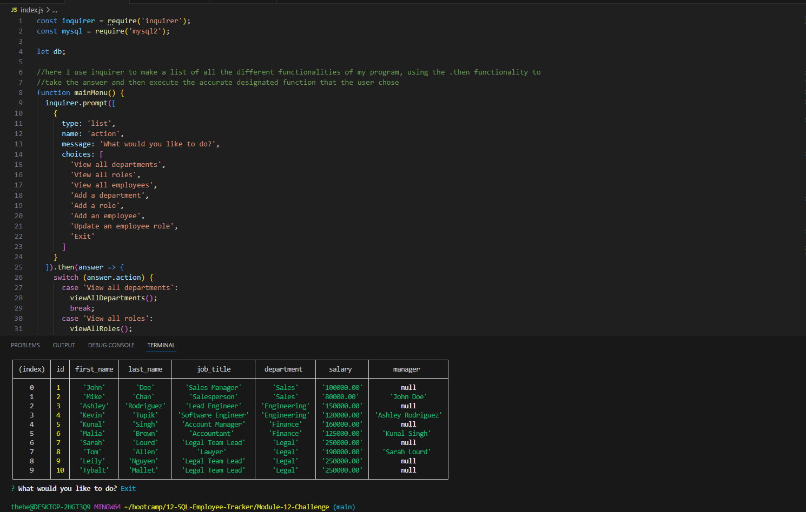

# SQL: Employee tracker

## Video Demo Link

https://youtu.be/beVKFpb-Ei8

## Description

This is the 12th Module project for the 12th week of the UCB Coding bootcamp, this week we focused on SQL and managing data tables. For this project we were given no starter code, and told to create a code using SQL and inquirer, where the user can create a table of employees that is fully customizable based on the users inputs. 

## Table of Contents
- [Description](#description)
- [WebsiteSS](#Screenshot)
- [Installation](#installation)
- [Usage](#usage)
- [License](#license)
- [Tests](#tests)
- [Questions](#questions)

## Screenshot 

## Installation

Initialize npm with inquirer@8.2.4 and mysql2, and have node installed. 

## Usage 

Launch the code using node, and simply enter your information in the prompts based on whatever companies one is managing, start by creating a department, then a role / job title, and what department that job is a part of and fill the appropriate information. From there you are able to create a new employee, and assign that employee a job, the rest of the information will automatically be added to the table. 

## Tests

N/A
## Questions

For any questions, reach out to [notUnEeVeN](https://github.com/notUnEeVeN) or [email me](mailto:tybalt.mallet@gmail.com).
